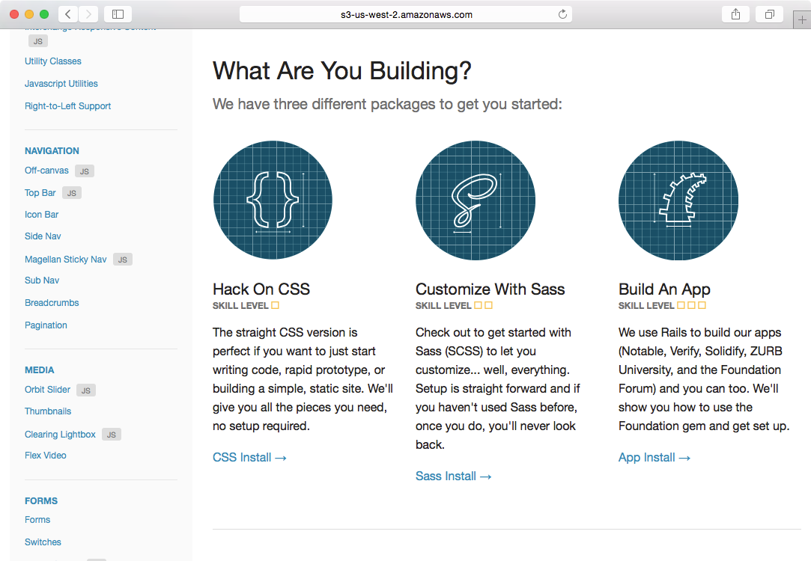
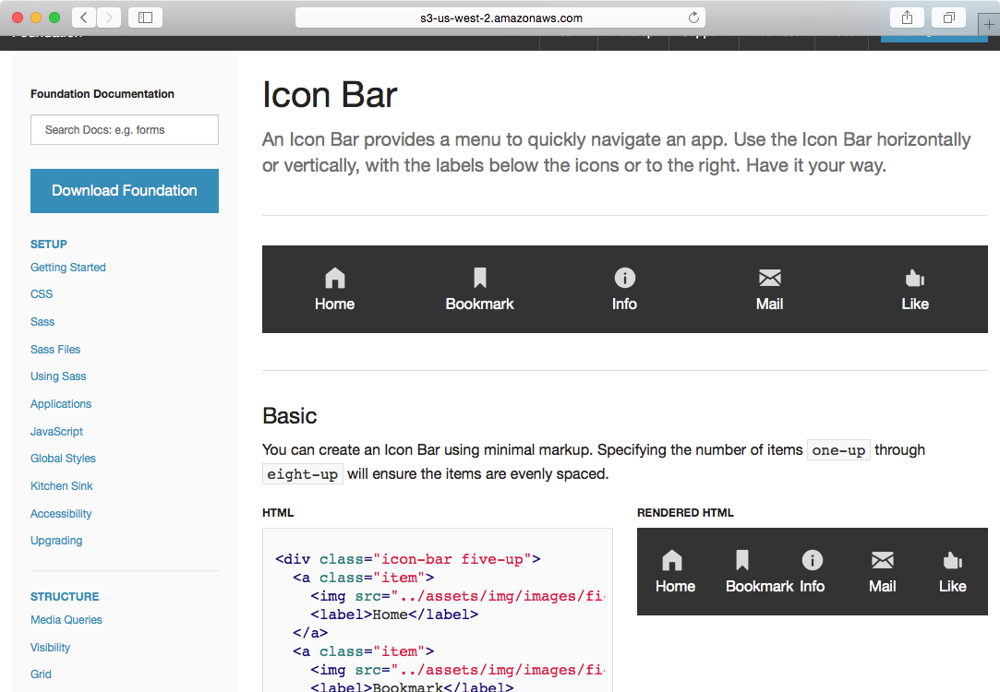
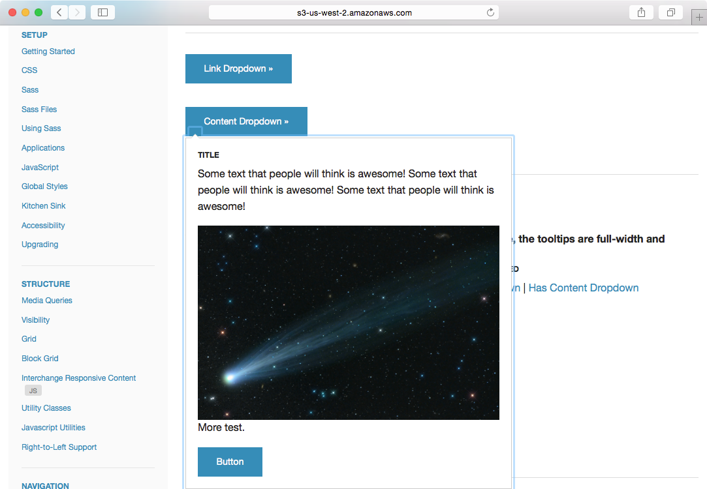
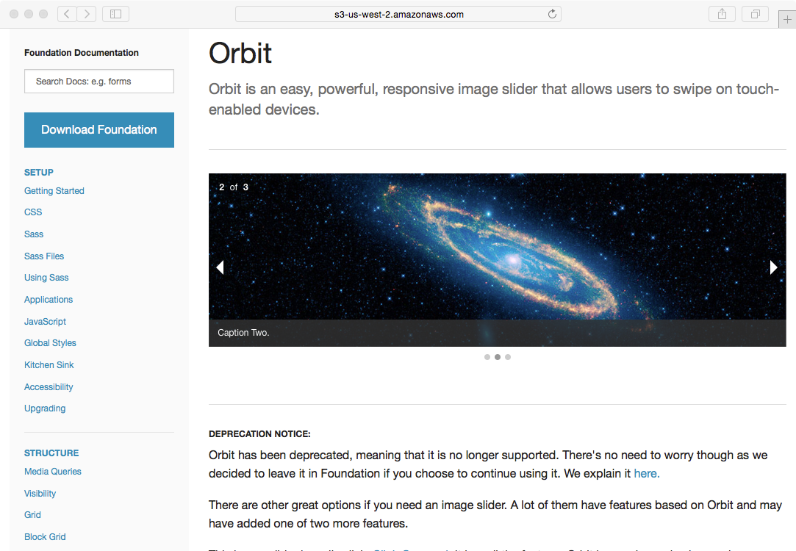
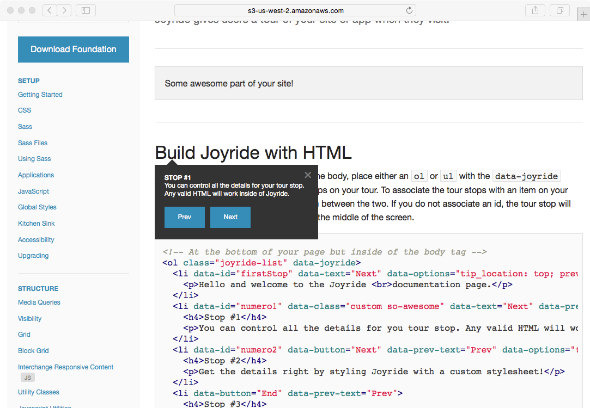

Demonstration of Zurb Foundation and Hiram Pages
=======

This fork of Zurb Foundation is used to test compatibility of Zurb Foundation sites with [Hiram Pages](https://www.hirampages.com) Bucket.

We do so by building the documentation, adding the [Hiram Pages Bridge](https://github.com/hiramsoft/hp-bridge) inline at *hp-bridge.html*,
and then publishing to a sample bucket.

Why?

By testing the documentation, which includes a comprehensive set of examples, we can assess how well most Foundation sites
will work with Hiram Pages.  In general, most of Foundation works with Hiram Pages, but Foundation can be a bit
more finicky than Bootstrap to get set up.

The original project is at [https://github.com/zurb/foundation](https://github.com/zurb/foundation).

Important Caveats
-------
First, it has been my experience that pulling from master with Zurb Foundation is perilous.  Always pick a known
good build.  Use the run-demo.sh and hp-bridge.html as examples, you may need to go back in the git log to get
a version with working JavaScript.

Second, for some of the JavaScript-based features, Zurb stores URLs inside data-* tags.  The Hiram Pages Bridge
does not look for URLs inside data-* tags and as a result the following components do not work:

* Orbit

Otherwise the examples in the documentation all appear to work... provided you are running a known good version.

The version from which we forked DOES NOT WORK.  Instead, we had to go back in time to a tagged release.

Testing yourself
-------

How to get the Zurb Foundation working in your bucket:

1. Install AWS CLI
2. Edit run-demo.sh use your bucket.  By default run-demo builds the documentation.
3. Run *run-demo.sh*
4. Go to Hiram Pages to create an "HP Bridge Static Site" link

Testing your own Zurb Foundation Site
-------

If you have a static website based on Foundation,
skip this project altogether,
and add the [Hiram Pages Bridge](https://github.com/hiramsoft/hp-bridge) inline at *hp-bridge.html*
to your project.

That's it.

Screenshots
-------

These screenshots reflect what you should see:

When this static website is hosted on S3 and locked by Hiram Pages, only people you allow may view the site.
